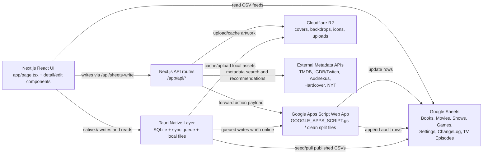

# Chris' Delicious Library Design Document

Version described: 11.0.2

This document is the rebuild guide for Chris' Delicious Library. It describes the app's purpose, screens, data sources, write paths, sync model, native behavior, Apps Script bridge, media metadata providers, artwork rules, and release workflow. A developer with access to the Google Sheet, R2 bucket, API keys, and this repo should be able to recreate the app from scratch.

## 1. Product Purpose

Chris' Delicious Library is a personal media library for Books, Movies, TV Shows, and Games. It replaces several separate tracking workflows with one app that can:

- Track owned, wanted, in-progress, completed, abandoned, backlog, and watch/read/play-next items.
- Add new media from external metadata providers.
- Edit metadata and personal fields.
- Rate media.
- Track TV episode progress by season and episode.
- Store artwork in Cloudflare R2 for fast, durable, offline-friendly display.
- Sync changes to Google Sheets.
- Run as a web app and as a local-first native macOS app.
- Cache images, icons, backdrops, cast photos, and row data for offline use.

The current web app is implemented as a Next.js app. The native Mac app is implemented with Tauri 2 and uses the same React UI with a local SQLite-backed sync layer.

## 2. Core Architecture



## 3. Main Repository Layout

Important files and folders:

- `app/page.tsx`: Main app shell, navigation, data loading, state, filtering, sorting, settings, save handlers, cover/list rendering, TV episode refresh and progress logic.
- `app/components/*DetailsPage.tsx`: Full details pages for Books, Movies, TV Shows, and Games.
- `app/components/*DetailsEditModal.tsx`: Edit modals for each media type.
- `app/components/Rate*Modal.tsx`: Rating and quick status/date edit flows.
- `app/components/AddItemModal.tsx`: Add-new-item entry point and provider selection.
- `app/components/StatisticsView.tsx`: Statistics dashboard, yearly modules, rating charts, top/bottom lists.
- `app/components/RoadmapView.tsx`: Roadmap/discover view.
- `app/components/RolodexCounter.tsx`: Sidebar animated count digits.
- `app/components/coverStyles.ts`: Shared cover radius style.
- `app/lib/mediaSearchClient.ts`: Client helper for metadata search.
- `app/native/bridge.ts`: Browser-to-Tauri bridge for native mode.
- `app/api/*/route.ts`: Server-side routes for writes, search, R2 uploads, TV episodes, recommendations, icons, roadmap, and sync.
- `src-tauri/src/lib.rs`: Native SQLite, sync queue, R2 native upload/cache, TMDB native episode fetch, and Tauri commands.
- `src-tauri/tauri.conf.json`: Tauri app version, bundle, build settings.
- `GOOGLE_APPS_SCRIPT.gs`: Single-file Apps Script replacement used by the current app.
- `apps-script-clean/*`: Safer split Apps Script files for WebApp/Menu/ChangeLog/TMDB cleanup.
- `scripts/build-native-renderer.mjs`: Static export workaround for native renderer.
- `public/`: Static assets, icons, textures, status images, and app artwork.
- `docs/`: Long-lived documentation, including this design document.

## 4. Runtime Targets

### Web

The web app runs on Next.js and is deployed through Vercel. Local development uses:

```bash
npm run dev
```

Production reads from published Google Sheet CSV URLs and writes through Apps Script URLs configured in environment variables.

### Native macOS

The native app uses Tauri:

```bash
npm run dev:native
npm run build:native
```

Native mode is enabled with `NEXT_PUBLIC_NATIVE_APP=true`. It uses the same React code but detects Tauri through `app/native/bridge.ts`. Native data is local-first:

- Rows and settings are stored in SQLite.
- Sheet writes are queued locally.
- R2 asset uploads can be stored and synced later.
- Cached cover/backdrop/cast/icon files are loaded from local disk when available.

### Mobile Web

The same Next.js UI is responsive. Mobile has specific layout behavior:

- Bottom navigation bar.
- Compact detail/edit layouts.
- List view renders as row cards instead of a dense table.
- Books, Movies, TV Shows, and Games default to Home dashboards when opened.

## 5. Environment Variables

The app depends on these environment groups. Local values live in `.env.local`; production values live in Vercel; native static builds need the same public values baked into the renderer.

### Published CSV read URLs

- `NEXT_PUBLIC_TV_SHEET_CSV_URL`: Shows sheet CSV.
- `NEXT_PUBLIC_TV_EPISODES_SHEET_CSV_URL`: TV Episodes sheet CSV.
- `NEXT_PUBLIC_BOOKS_SHEET_CSV_URL`: Books sheet CSV.
- `NEXT_PUBLIC_MOVIES_SHEET_CSV_URL`: Movies sheet CSV.
- `NEXT_PUBLIC_GAMES_SHEET_CSV_URL`: Games sheet CSV.
- `NEXT_PUBLIC_SETTINGS_SHEET_CSV_URL`: Settings sheet CSV.
- `NEXT_PUBLIC_CHANGELOG_SHEET_CSV_URL`: ChangeLog sheet CSV.

### Apps Script write URLs

- `NEXT_PUBLIC_SETTINGS_WRITE_URL`
- `NEXT_PUBLIC_BOOKS_WRITE_URL`
- `NEXT_PUBLIC_SHOWS_WRITE_URL`
- `NEXT_PUBLIC_TV_WRITE_URL` as a fallback for shows.
- `NEXT_PUBLIC_MOVIES_WRITE_URL`
- `NEXT_PUBLIC_GAMES_WRITE_URL`

These normally point to the same Apps Script `/exec` deployment URL, but the app supports separate URLs.

### Metadata API keys

- `TMDB_BEARER_TOKEN` or `TMDB_API_READ_ACCESS_TOKEN`
- `TMDB_API_KEY` fallback
- `IGDB_CLIENT_ID` or `TWITCH_CLIENT_ID`
- `IGDB_CLIENT_SECRET` or `TWITCH_CLIENT_SECRET`
- `HARDCOVER_API_KEY`
- `NYT_BOOKS_API_KEY`, `NEW_YORK_TIMES_API_KEY`, or `NYT_API_KEY`

Audnexus/Audible catalog search currently uses public endpoints and does not require an app key.

### R2 storage

- `R2_ACCOUNT_ID`
- `R2_ACCESS_KEY_ID`
- `R2_SECRET_ACCESS_KEY`
- `R2_BUCKET_NAME`
- `R2_PUBLIC_URL`

### Runtime flags

- `NEXT_PUBLIC_NATIVE_APP=true`: Enables Tauri/native bridge behavior.
- `NEXT_PUBLIC_STATIC_SITE=true`: Used by native/static export flow.
- `NEXT_PUBLIC_LOCALHOST_SETTINGS_READ_ONLY=false`: Allows localhost settings writes. By default, localhost web mode protects settings writes unless this is disabled.

## 6. Google Sheets Data Model

Google Sheets is the main shared database. The web app reads published CSVs. Writes go through Apps Script so validation, timestamps, and ChangeLog logging can happen server-side.

### Books

Important columns:

- `Cover`
- `Title`
- `Subtitle`
- `Series`
- `Author`
- `Narrator`
- `Publisher`
- `Ownership`
- `Type`: only `Physical`, `Audiobook`, or `eBook`.
- `Status`: examples include `Reading`, `Read Next`, `Completed`, `Backlog`, `Abandoned`, `Paused`, `Wishlist`.
- `CompletedDate`
- `isbn`, `ISBN13`
- `ReleaseDate`
- `description`
- `ImageURL`: default metadata artwork source.
- `CustomURL` / `CustomImageURL`: compatibility plumbing for custom displayed artwork.
- `R2CoverUrl`: primary displayed book cover.
- `R2CoverUrl_Date`
- `userRating`
- `My Rating`
- `pages`
- `audiobookDuration`
- `genre`
- `tags`
- `HardcoverID`
- `AudibleASIN`
- `AudnexusASIN`
- recommendation helper columns.
- `LastModifiedAt`
- `ClientUpdatedAt`

User-facing artwork model: there are two concepts only. "Default" is metadata artwork from `ImageURL`. "R2" is the displayed artwork from `R2CoverUrl`. Legacy custom columns exist only to keep old sheet/app flows compatible.

### Movies

Important columns:

- `Title`
- `TMDB_ID`
- `ReleaseDate`
- `Watch Status`: examples include `Watched`, `Backlog`, `Abandoned`, `Started`, `Pending Digital Release`.
- `WatchDate`
- `My Rating`
- `TMDB Rating`
- `Runtime`
- `Genres`
- `PosterURL` / `ImageURL` / `metadataCoverUrl`
- `BackdropURL`
- `R2CoverUrl`
- `R2BackdropUrl`
- `R2CoverUrl_Date`
- `R2BackdropUrl_Date`
- recommendation helper columns.
- `LastModifiedAt`
- `ClientUpdatedAt`

Movies use TMDB as the primary metadata source.

### TV Shows

Important columns:

- `Title`
- `TMDB_ID`
- `WatchStatus`: current user state. Current active state is `Started`.
- `ShowStatus`: external show state, such as `Ended`, `Returning Series`, `Canceled`, or `In Production`.
- `FirstAirDate`
- `LastAirDate`
- `NumberOfSeasons`
- `NumberOfEpisodes`
- `EpisodeRuntime` / runtime fields.
- `Networks`
- `StreamingUS`
- `Genres`
- `TMDB Rating`
- `My Rating`
- `BackdropURL`
- `Overview`
- `Creator`
- `Topcast`
- `TopcastPhotos`
- `R2CoverUrl`
- `R2BackdropUrl`
- recommendation helper columns.
- `LastModifiedAt`
- `ClientUpdatedAt`

TV shows use TMDB for show metadata, cast, backdrops, and episode metadata.

### Games

Important columns:

- `Title`
- `IGDB_ID`
- `Platform`
- `Status`: examples include `Now Playing`, `Play Next`, `Queued`, `Collection`, `Completed`, `Abandoned`, `Wishlist`.
- `Ownership`
- `ReleaseDate`
- `Date Completed`
- `Date Added`
- `My Rating`
- `IGDB Rating`
- `TimeToBeat`
- `Developer`
- `Genres`
- `Tags`
- `ImageURL` / cover URL.
- `ScreenshotsURL` / backdrop source.
- `R2CoverUrl`
- `R2BackdropUrl`
- `LastModifiedAt`
- `ClientUpdatedAt`

Games use IGDB/Twitch. Duplicate games on different platforms are valid and must remain separate rows.

### TV Episodes

The `TV Episodes` tab stores episode metadata and user progress.

Required columns:

```text
EpisodeKey
ShowTMDB_ID
ShowTitle
SeasonNumber
SeasonTitle
SeasonPosterURL
EpisodeNumber
EpisodeTMDB_ID
EpisodeTitle
AirDate
StillURL
Overview
Runtime
Watched
WatchedAt
UpdatedAt
Source
LastModifiedAt
ClientUpdatedAt
```

`EpisodeKey` is the stable unique identifier:

```text
<ShowTMDB_ID>:s<SeasonNumber>:e<EpisodeNumber>
```

Episode progress is user-owned data. Metadata refresh can update episode title, air date, still, overview, runtime, season title, and season poster. It must not overwrite `Watched` or `WatchedAt`.

### Settings

Settings are stored as key/value rows:

```text
Category | Key | Value | Description | LastModifiedAt | ClientUpdatedAt
```

Settings cover UI preferences, order lists, icons, themes, display modes, list columns, list column widths, cover sizing, and similar user preferences. Settings are also cached locally for fast startup.

### ChangeLog

ChangeLog columns:

```text
Timestamp | Source | Sheet | Title | Row | Field | Old Value | New Value | User | Function
```

It records manual sheet edits, metadata script changes, and app-side changes. Apps Script keeps only the latest 2,000 log rows plus the header.

## 7. Read Flow

The app reads data this way:

1. Web mode loads published CSVs from the `NEXT_PUBLIC_*_SHEET_CSV_URL` values.
2. CSVs are parsed with Papa Parse.
3. Rows are normalized into typed app objects in `app/page.tsx`.
4. Artwork candidates are derived from R2, metadata source fields, native local cache fields, and legacy custom fields.
5. Settings load from local cache first, then from the Settings CSV.
6. Native mode first reads a local SQLite snapshot through `nativeReadSnapshot()`.
7. Native mode seeds SQLite from CSV when needed, then syncs/pulls again when online.

The app intentionally tolerates multiple possible column names because the spreadsheet evolved over time.

## 8. Write Flow

Most writes follow this path:

1. User edits a field in the app.
2. `app/page.tsx` builds an action payload such as `updateMovie`, `updateBook`, `updateShow`, `updateGame`, `addBook`, or `updateTvEpisodeProgress`.
3. Web mode calls `postSheetWrite()`.
4. `postSheetWrite()` posts to `/api/sheets-write`.
5. `/api/sheets-write` validates that the target URL is a Google Apps Script URL, normalizes known fields, and forwards the payload to Apps Script as text JSON.
6. Apps Script `doPost(e)` routes by `payload.action`.
7. The specific Apps Script handler finds the row, writes cells, stamps timestamp columns, and returns a success/error response.
8. For normal media edits, the app performs CSV readback verification before reporting success.
9. For TV episode progress, Apps Script verifies the written `Watched` value before returning success.
10. ChangeLog entries are appended for changes that should be auditable.

Native mode changes the middle:

1. The UI calls a `native://` write route.
2. Tauri persists the change to local SQLite immediately.
3. A pending write is added to `sync_queue`.
4. When online, native sync forwards queued writes to Apps Script.
5. Native pulls published CSVs after pending writes clear.

## 9. Apps Script Bridge

`GOOGLE_APPS_SCRIPT.gs` is the current single-file Apps Script bridge. The clean split replacement files live under `apps-script-clean/`.

`doPost(e)` supports:

- `updateBook`
- `updateShow`
- `updateMovie`
- `updateGame`
- `deleteBook`
- `deleteShow`
- `deleteMovie`
- `deleteGame`
- `addBook`
- `addShow`
- `addMovie`
- `addGame`
- `appendChangeLogRows`
- `upsertTvEpisodeRows`
- `updateTvEpisodeProgress`
- `debugWebAppVersion`

Important Apps Script rules:

- `onOpen()` belongs in `Menu.gs` in the clean split setup, not the web-app bridge.
- `doPost()`, `doOptions()`, and `createCORSResponse()` should only exist once.
- `appendChangeLogRows_()` should only exist once.
- Deploy a new web app version after any Apps Script change.
- If the app writes but ChangeLog does not update, first verify the deployed `/exec` URL and the Apps Script build response.

## 10. TV Episode Tracking

Episode tracking is implemented in v11.

### Loading episodes

When a TV details page opens:

1. The app checks cached `TV Episodes` rows for that show's `TMDB_ID`.
2. If there are no rows or the metadata is stale, the app calls:
   - Web: `/api/tv-episodes?tmdbId=<id>&title=<title>`
   - Native: `nativeLoadTvEpisodes()`
3. The route/native layer fetches show seasons from TMDB and then each season's episode list.
4. Rows are merged with existing watched progress.
5. The app upserts metadata rows to the `TV Episodes` sheet with `upsertTvEpisodeRows`.

### Daily refresh

The app refreshes active TV episode metadata once a day while the app is open. This is app-driven, not a server cron. New seasons/episodes appear after a daily refresh or after pressing "Refresh Episodes" in a TV details page.

### Episode UI

TV details pages show:

- `Watch Next`: horizontal row of next unwatched released episodes.
- `All Episodes`: season accordion.
- Season rows with poster, completion state, and watched toggle.
- Episode rows with still, episode number, title, air date, and watched toggle.
- Bulk actions:
  - Mark individual episode watched/unwatched.
  - Mark full season watched/unwatched.
  - Mark released episodes watched.
  - Mark watched through an episode.

The UI updates optimistically for instant feedback, then rolls back if the write fails.

### Progress write reliability

Episode progress writes use `updateTvEpisodeProgress`. The Apps Script handler:

- Finds the episode by `EpisodeKey` or show/season/episode.
- Writes `Watched`, `WatchedAt`, and `UpdatedAt`.
- Appends ChangeLog rows for `Watched` and `WatchedAt`.
- Flushes the spreadsheet.
- Reads back `Watched`.
- Returns JSON with the confirmed value.

## 11. Metadata Providers

### TMDB

Used for:

- Movie search and details.
- TV show search and details.
- TV episodes and season posters.
- Cast photos.
- Backdrops.
- Recommendations/discovery.

Images use TMDB image base URLs such as `w500`, `w780`, `w1280`, and larger cast profile sizes where appropriate.

### IGDB/Twitch

Used for:

- Game search.
- Game metadata.
- Game covers.
- Platforms.
- Release dates.
- Screenshots/backdrops.
- Genres/developer.

The app authenticates through Twitch client credentials and caches the IGDB access token server-side.

### Audnexus/Audible Catalog

Used for audiobook-first book metadata:

- Audiobook search.
- Edition selection.
- Narrator.
- Publisher.
- Runtime.
- Square audiobook cover art.
- Audible/Audnexus ASIN.
- Release date and rating where available.

This replaced Apple Books as the main audiobook path.

### Hardcover

Still used for book metadata and editions, especially non-audiobook records. Hardcover IDs remain row-match keys for saves.

### New York Times Books API

Used for the Books Home "New York Times Bestsellers" section. It fetches fiction bestsellers, filters out books already in the library, and links to the best available external NYT/book URL.

## 12. Artwork and R2 Rules

Cloudflare R2 is the durable artwork layer. The displayed image should prefer R2 when available.

### Display priority

General priority:

1. Native local cached asset path, if running native and available.
2. R2 cover/backdrop URL.
3. Current metadata image URL.
4. Legacy custom URL fields, only as compatibility fallback.
5. Static or generated fallback.

For books specifically, user-facing controls should present:

- Default: metadata image (`ImageURL`).
- R2: displayed artwork (`R2CoverUrl`).

### Sync Default to R2

This action uploads the current metadata artwork to R2 and updates the sheet's R2 field. It is used when metadata artwork changed but the old R2 backup is still displayed.

### Upload Custom R2

This action uploads a local user-selected image to R2 and updates the sheet so R2 becomes the displayed custom artwork. Compatibility fields like `CustomURL` can be written behind the scenes, but the UI should not make users reason about them.

### Backdrops

Movies, TV Shows, and Games can use R2 backdrop URLs. Movie/TV backdrops come from TMDB; games use screenshots or IGDB artwork.

### Icons

Sidebar and status icons are managed in the Icons page. Latest online icons are cached locally in native mode so offline launches still show the correct icons.

## 13. Navigation and Major Screens

### Sidebar

The sidebar shows:

- Logo.
- Search.
- Library: Home, Books, Movies, TV Shows, Games.
- Animated rolodex counters for media counts.
- Smart Lists: This Year, Current, Completed, Abandoned, plus custom lists.
- Discover: Statistics, Roadmap, Themes, Icons, Activity Log.
- Cover size slider.
- Sync status module.

Media rows default to Home dashboards. This must hold across desktop web, mobile web, and native.

### Common header controls

Eligible views show:

- Section tabs, such as Home, Library, Upcoming, Backlog, Started, Completed, Wishlist.
- Clear.
- Status toggle.
- Item count.
- Cover/List segmented control.
- Filter/settings panel.
- Add.
- Settings/gear where relevant.

Custom Home dashboards do not use generic List view.

## 14. Cover View

Cover view is the original visual library layout.

Features:

- Adjustable cover size.
- Status icons on covers when enabled.
- Rating badges.
- Glossy hover/motion effect.
- Rounded artwork corners.
- Media-aware aspect ratios.
- Custom row/shelf spacing.
- Manual order for Play Next, Read Next, Movie Watchlist, and TV Watchlist.

Ordering rules are strict: if a Home dashboard section says it mirrors another source list, it must preserve that source order exactly.

## 15. List View

List view is a second display mode for eligible library/list screens. It does not apply to Books Home, Movies Home, TV Shows Home, or Games Home.

Features:

- Per-view `Cover | List` preference.
- Per-view column configuration.
- Per-view column widths.
- Inline edit mode.
- Dropdowns for fields like Status, Platform, Ownership, and Type.
- Date fields use date inputs/calendar controls.
- Editable list changes save back to Google Sheets.
- Mobile list view uses compact cards.

Default columns:

- Books: Cover, Title, Author, Type, Status, Release Date, Completed Date, My Rating, User Rating, Series.
- Movies: Cover, Title, Watch Status, Release Date, Watch Date, My Rating, TMDB Rating, Runtime, Genres.
- TV Shows: Cover, Title, Watch Status, Show Status, First Air Date, Last Air Date, My Rating, TMDB Rating, Seasons.
- Games: Cover, Title, Platform, Status, Ownership, Release Date, Date Completed, My Rating, IGDB Rating, Time To Beat.
- Mixed lists: Cover, Media Type, Title, Status, Release/Date, Rating.

Preferences use keys like:

- `viewDisplayMode:<viewKey>`
- `viewListColumns:<viewKey>`
- `viewListColumnWidths:<viewKey>`
- `listSize:<viewKey>`

## 16. Home Dashboards

Home dashboards are custom screens and should not be forced into generic cover/list rules.

### Books Home

Sections:

- Read Next, matching Home header Read Next order.
- New Releases.
- Upcoming.
- Statistics.
- New York Times Bestsellers.

Books preserve actual cover aspect ratio, especially audiobooks. Book ratings display on a 5.0 scale with decimals.

### Movies Home

Sections:

- Watchlist, matching Movie Watchlist source order.
- New Releases.
- Upcoming.
- Statistics.
- Recommended from TMDB, excluding movies already in the library.

### TV Shows Home

Sections:

- Watchlist/Started sections, matching TV Watchlist source order.
- New Releases.
- Upcoming.
- Statistics.
- Recommended.

Started TV shows use the "In Progress" icon. Watch Next TV shows use the "Not Started" icon.

### Games Home

Sections:

- In Progress.
- Play Next, matching Home Play Next order.
- New Releases, including already released wishlist items.
- Upcoming.
- Statistics, including monthly completed bars.
- Recommended online/offline fallback.

Games support a custom "Now Playing" status icon.

## 17. Smart Lists and Ordering

Smart Lists include:

- This Year.
- Current.
- Completed.
- Abandoned.
- Custom smart lists.

Completed smart lists sort by the relevant completion/watch date newest first:

- Movies: `WatchDate`.
- Books: `CompletedDate`.
- Games: `Date Completed`.
- TV Shows: completed/watched date where available.

Manual ordering is used for:

- Read Next.
- Play Next.
- Movie Watchlist.
- TV Watchlist.

Those orders must be saved as settings and must survive refresh/reload. The app should not reorder them except when the user manually drags items.

## 18. Details Pages

Each media type has a full details page and edit modal.

### Books

Details include cover, title, subtitle, author, narrator, series, description, type, status, ownership, release/completed dates, pages/runtime, genre/tags, ratings, and external links. Book cover clicks should use Goodreads-style external links when available.

### Movies

Details include poster, backdrop, title, release date, status, watch date, runtime, genres, overview, cast, ratings, You May Also Like, edit and rate flows.

### TV Shows

Details include poster, backdrop, title, show status, watch status, first/last air dates, creator, seasons, total episodes, episodes watched, ratings, cast, recommendations, and the episode tracker.

### Games

Details include cover, backdrop/screenshots, title, release year/date, platform, ownership, status, developer, genres, IGDB rating, personal rating, Time To Beat, and external IGDB linking. External game lookups include release year to avoid wrong matches.

## 19. Add and Edit Flows

### Add flow

`AddItemModal` lets the user choose the media type and provider. It searches metadata providers, presents result/edition choices, then creates a row in the correct sheet.

### Books

Book Type must only be:

- `Physical`
- `Audiobook`
- `eBook`

"Strategy Guide" belongs in genre or tags, not Type.

Audnexus is the preferred audiobook metadata path. Hardcover remains available. Apple Books is no longer the preferred book metadata source.

### Movies and TV Shows

TMDB is used for search and sync. App writes use `TMDB_ID` first and title fallback.

### Games

IGDB is used for search and sync. Matching uses `IGDB_ID` plus platform when available so duplicate versions on different platforms stay separate.

## 20. Sync, Caching, and Offline Behavior

### Web

Web mode reads live published CSVs. The sidebar refresh button performs a hard data refresh so newly saved Google Sheet data is visible without a browser hard reload.

### Native

Native mode:

- Loads local SQLite first.
- Seeds from CSV if needed.
- Queues writes while offline.
- Preserves local pending rows during remote pulls.
- Pushes queued writes when online.
- Pulls remote CSV snapshots after pending writes are clear.
- Stores cached cover, backdrop, cast, icon, and asset paths.
- Shows cache counts in the sync module.

Native sync queue conflict behavior:

- Local queued writes carry `ClientUpdatedAt`.
- Remote rows carry `LastModifiedAt`.
- If remote is newer than local pending write, native should skip the stale queued write rather than overwrite newer remote data.

## 21. Activity Log

The old Cover Sync area is now Activity Log. It reads the ChangeLog CSV and shows sheet/app activity in the app so the user does not need to open Google Sheets.

Activity Log depends on `NEXT_PUBLIC_CHANGELOG_SHEET_CSV_URL`.

## 22. Statistics

Statistics includes:

- Year summary modules.
- Top-rated pick.
- Longest audiobook.
- Most played game.
- Lowest rated item.
- Pace vs previous year.
- Genre/status/rating charts.
- Top 20 and Bottom 20 rated in the selected year.
- Top 10 comparisons for media categories.

Top rated cover modules use consistent cover width, small equal gaps, no title labels under covers, and rank/rating labels below covers. Book ratings remain on a 5.0 decimal scale; other ratings use the appropriate source display but should keep decimals in top-rated modules.

## 23. Roadmap, Themes, Icons, and Settings

### Roadmap

Roadmap syncs from live data and appears in both web and native.

### Themes

Themes control app colors and visual mode. The app supports light/dark themes and media-specific accent colors.

### Icons

Icons page manages:

- Sidebar icons.
- Status icons.
- The extra Games `Now Playing` icon.

Icons should update online and cache locally for native/offline use.

### Settings

Settings include:

- Cover size.
- Sidebar module settings.
- Theme choices.
- Status icon visibility.
- Manual list ordering.
- List view columns and widths.
- Cached UI preferences.

## 24. Important Reliability Rules

- Never show a successful save unless the app has confirmation.
- For media row edits, CSV readback verification is the main confirmation path.
- For TV episode progress, Apps Script write verification confirms the cell value.
- Metadata refreshes must not overwrite user-owned fields.
- R2 should remain the primary displayed artwork once synced.
- Duplicate game rows by platform must remain visible and independently editable.
- Watchlist/read-next/play-next order must not change unless the user manually changes it.
- App-side writes should create ChangeLog entries where practical.
- If logging fails, the main write should still be allowed unless the data write itself failed.

## 25. Build and Release Workflow

Standard local checks:

```bash
npm run build
cargo check --manifest-path src-tauri/Cargo.toml
git diff --check
```

Native build:

```bash
npm run build:native
```

Native DMGs are created under:

```text
src-tauri/target/release/bundle/dmg/
```

The native renderer build uses `scripts/build-native-renderer.mjs`, which works around static export conflicts with `app/api/*`.

Version bump locations:

- `app/page.tsx` `APP_VERSION`.
- Top entry in `VERSION_HISTORY`.
- `package.json`.
- `src-tauri/Cargo.toml`.
- `src-tauri/tauri.conf.json`.
- `src-tauri/Cargo.lock`.
- Apps Script build string when the bridge changes.

## 26. Apps Script Deployment Workflow

When Apps Script code changes:

1. Open Apps Script for the Google Sheet.
2. Replace the intended file contents.
3. Confirm only one copy of `doPost`, `doOptions`, and `createCORSResponse` exists.
4. Save.
5. Deploy > Manage deployments.
6. Edit the web app deployment.
7. Choose "New version".
8. Deploy.
9. Confirm the `/exec` URL is the same URL used in `.env.local` and Vercel.
10. Run a test write or `debugWebAppVersion`.

## 27. Recreate From Scratch Checklist

1. Create a Google Sheet with tabs:
   - `Books`
   - `Movies`
   - `Shows`
   - `Games`
   - `Settings`
   - `ChangeLog`
   - `TV Episodes`
2. Add the columns listed in this document.
3. Publish the read tabs to CSV and collect the published CSV URLs.
4. Create a Google Apps Script project attached to the sheet.
5. Add the Apps Script files, preferably using the clean split layout:
   - `WebApp.gs`
   - `Menu.gs`
   - `ChangeLogBridge.gs`
   - `TMDB.gs`
   - keep Books/Movies/GamesIGDB/R2/TV metadata scripts as needed.
6. Deploy Apps Script as a web app.
7. Create a Cloudflare R2 bucket and public URL.
8. Create API credentials for TMDB, Twitch/IGDB, Hardcover, and NYT.
9. Configure `.env.local` with all CSV URLs, Apps Script URLs, R2 values, and metadata keys.
10. Install dependencies:
    ```bash
    npm install
    ```
11. Run locally:
    ```bash
    npm run dev
    ```
12. Validate reading data from all CSV tabs.
13. Validate edits for one Book, Movie, TV Show, Game, and TV Episode.
14. Validate ChangeLog entries.
15. Validate R2 upload and Sync Default to R2.
16. Validate native:
    ```bash
    npm run build:native
    ```
17. Install the generated DMG and confirm offline launch/data cache.

## 28. Known Constraints and Future Improvements

- `app/page.tsx` is a large monolith. Future work should split state, data adapters, renderers, and sync helpers into modules.
- Google Sheets is convenient but fragile for high-volume or multi-device concurrent writes. A real database/API backend would improve reliability long-term.
- Daily TV episode refresh happens when the app is opened, not on a server schedule.
- Published CSVs can lag behind Apps Script writes, so readback checks include normalization and retries.
- Native sync depends on public CSV availability and Apps Script write availability.
- Book metadata providers remain imperfect; Audnexus is better for audiobooks, Hardcover is better for general editions.
- Some legacy columns remain for compatibility and should be treated carefully during refactors.
