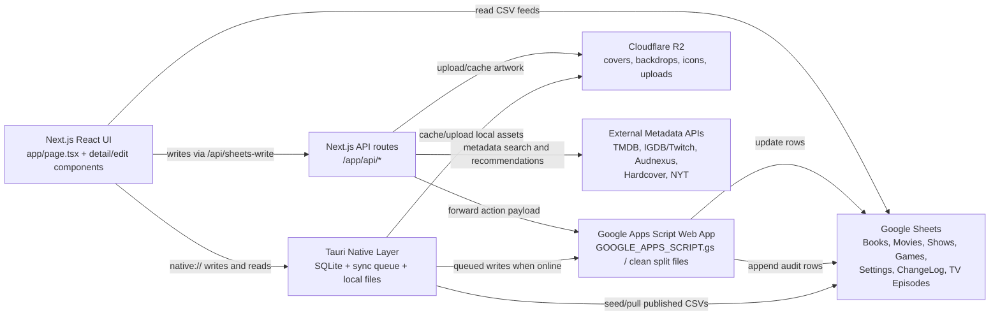

# Chris' Delicious Library Design Document

Version described: 13.0.3

Document last verified against the repository: 2026-08-03

This document is the authoritative product, design, architecture, migration, and rebuild guide for Chris' Delicious Library. It describes the app's purpose, every major screen and interaction, data sources, data ownership rules, write paths, synchronization model, native behavior, Apps Script bridge, metadata providers, artwork rules, responsive behavior, visual language, build pipeline, and release workflow. A developer with access to the Google Sheet, R2 bucket, API keys, licensed media assets, and this repository should be able to recreate the application from scratch or move development to another computer without relying on conversation history.

This document describes the production Next.js/Tauri application in this repository. The separate SwiftUI Apple companion project is intentionally isolated and is not the subject of this document.

## Document Map

- Sections 1-4: product purpose, architecture, repository layout, and runtime targets.
- Sections 5-9: environment, Google Sheets schemas, settings, ChangeLog, and external providers.
- Sections 10-16: artwork, read/write flows, save reliability, metadata editing, and TV episodes.
- Sections 17-24: navigation, dashboards, Cover/List views, details, Statistics, native behavior, and offline sync.
- Sections 25-28: build/release workflow, Apps Script deployment, testing, and known constraints.
- Section 29: exhaustive page-by-page and interaction catalog.
- Sections 30-35: data ownership, API contracts, persistence keys, Tauri internals, visual design, and responsive/accessibility rules.
- Sections 36-39: Windows migration, security, acceptance checklist, and authoritative decisions.

When rebuilding, read Sections 1-16 first for behavior and data contracts, Section 29 for the complete user experience, and Sections 30-39 before implementing persistence, native packaging, or release automation.

## 1. Product Purpose

Chris' Delicious Library is a personal media library for Books, Movies, TV Shows, and Games. It replaces several separate tracking workflows with one app that can:

- Track owned, wanted, in-progress, completed, abandoned, backlog, and watch/read/play-next items.
- Add new media from external metadata providers.
- Edit metadata and personal fields.
- Rate media.
- Track TV episode progress by season and episode.
- Store artwork in Cloudflare R2 for fast, durable, offline-friendly display.
- Sync changes to Google Sheets.
- Run as a web app and as a local-first native desktop app. The current packaged target is macOS; Windows packaging is specified in Section 36.
- Cache images, icons, backdrops, cast photos, and row data for offline use.

The current web app is implemented as a Next.js app. The native Mac app is implemented with Tauri 2 and uses the same React UI with a local SQLite-backed sync layer.

## 2. Core Architecture



## 3. Main Repository Layout

Important files and folders:

- `app/page.tsx`: Main app shell, navigation, data loading, state, filtering, sorting, settings, save handlers, cover/list rendering, TV episode refresh and progress logic.
- `app/components/*DetailsPage.tsx`: Full details pages for Books, Movies, TV Shows, and Games.
- `app/components/*DetailsEditModal.tsx`: Edit modals for each media type.
- `app/components/Rate*Modal.tsx`: Rating and quick status/date edit flows.
- `app/components/AddItemModal.tsx`: Add-new-item entry point, media/provider selection, search results, and book edition selection.
- `app/components/StatisticsView.tsx`: Statistics dashboard, media-specific analytics, Year in Review, Wrapped playback, rating charts, and top/bottom lists.
- `app/components/MediaDetailsSidebar.tsx`: Single-click compact details inspector shared by all media types.
- `app/components/RoadmapView.tsx`: Roadmap/discover view.
- `app/components/RolodexCounter.tsx`: Sidebar animated count digits.
- `app/lib/mediaSearchClient.ts`: Client helper for metadata search.
- `app/native/bridge.ts`: Browser-to-Tauri bridge for native mode.
- `app/api/*/route.ts`: Server-side routes for writes, search, R2 uploads, TV episodes, recommendations, icons, roadmap, and sync.
- `src-tauri/src/lib.rs`: Native SQLite, sync queue, R2 native upload/cache, TMDB native episode fetch, and Tauri commands.
- `src-tauri/tauri.conf.json`: Tauri app version, bundle, build settings.
- `GOOGLE_APPS_SCRIPT.gs`: Single-file Apps Script replacement used by the current app.
- `apps-script-clean/*`: Safer split Apps Script files for WebApp/Menu/ChangeLog/TMDB cleanup.
- `scripts/build-native-renderer.mjs`: Static export workaround for native renderer.
- Repository-root image files and generated static output: shelf textures, platform frames, icons, logos, and compatibility artifacts. New source assets should preferably live in a dedicated public asset folder during future cleanup.
- `docs/`: Long-lived documentation, including this design document.

## 4. Runtime Targets

### Web

The web app runs on Next.js and is deployed through Vercel. Local development uses:

```bash
npm run dev
```

Production reads from published Google Sheet CSV URLs and writes through Apps Script URLs configured in environment variables.

### Native Desktop (Currently macOS)

The native app uses Tauri:

```bash
npm run dev:native
npm run build:native
```

Native mode is enabled with `NEXT_PUBLIC_NATIVE_APP=true`. It uses the same React code but detects Tauri through `app/native/bridge.ts`. Native data is local-first:

- Rows and settings are stored in SQLite.
- Sheet writes are queued locally.
- R2 asset uploads can be stored and synced later.
- Cached cover/backdrop/cast/icon files are loaded from local disk when available.

### Mobile Web

The same Next.js UI is responsive. Mobile has specific layout behavior:

- Bottom navigation bar.
- Compact detail/edit layouts.
- List view renders as row cards instead of a dense table.
- Books, Movies, TV Shows, and Games default to Home dashboards when opened.

## 5. Environment Variables

The app depends on these environment groups. Local values live in `.env.local`; production values live in Vercel; native static builds need the same public values baked into the renderer.

### Published CSV read URLs

- `NEXT_PUBLIC_TV_SHEET_CSV_URL`: Shows sheet CSV.
- `NEXT_PUBLIC_TV_EPISODES_SHEET_CSV_URL`: TV Episodes sheet CSV.
- `NEXT_PUBLIC_BOOKS_SHEET_CSV_URL`: Books sheet CSV.
- `NEXT_PUBLIC_MOVIES_SHEET_CSV_URL`: Movies sheet CSV.
- `NEXT_PUBLIC_GAMES_SHEET_CSV_URL`: Games sheet CSV.
- `NEXT_PUBLIC_SETTINGS_SHEET_CSV_URL`: Settings sheet CSV.
- `NEXT_PUBLIC_CHANGELOG_SHEET_CSV_URL`: ChangeLog sheet CSV.

### Apps Script write URLs

- `NEXT_PUBLIC_SETTINGS_WRITE_URL`
- `NEXT_PUBLIC_BOOKS_WRITE_URL`
- `NEXT_PUBLIC_SHOWS_WRITE_URL`
- `NEXT_PUBLIC_TV_WRITE_URL` as a fallback for shows.
- `NEXT_PUBLIC_MOVIES_WRITE_URL`
- `NEXT_PUBLIC_GAMES_WRITE_URL`

These normally point to the same Apps Script `/exec` deployment URL, but the app supports separate URLs.

### Metadata API keys

- `TMDB_BEARER_TOKEN` or `TMDB_API_READ_ACCESS_TOKEN`
- `TMDB_API_KEY` fallback
- `IGDB_CLIENT_ID` or `TWITCH_CLIENT_ID`
- `IGDB_CLIENT_SECRET` or `TWITCH_CLIENT_SECRET`
- `HARDCOVER_API_KEY`
- `NYT_BOOKS_API_KEY`, `NEW_YORK_TIMES_API_KEY`, or `NYT_API_KEY`

Audnexus/Audible catalog search currently uses public endpoints and does not require an app key.

### R2 storage

- `R2_ACCOUNT_ID`
- `R2_ACCESS_KEY_ID`
- `R2_SECRET_ACCESS_KEY`
- `R2_BUCKET_NAME`
- `R2_PUBLIC_URL`

### Runtime flags

- `NEXT_PUBLIC_NATIVE_APP=true`: Enables Tauri/native bridge behavior.
- `NEXT_PUBLIC_STATIC_SITE=true`: Used by native/static export flow.
- `NEXT_PUBLIC_LOCALHOST_SETTINGS_READ_ONLY=false`: Allows localhost settings writes. By default, localhost web mode protects settings writes unless this is disabled.

## 6. Google Sheets Data Model

Google Sheets is the main shared database. The web app reads published CSVs. Writes go through Apps Script so validation, timestamps, and ChangeLog logging can happen server-side.

### Books

Important columns:

- `Cover`
- `Title`
- `Subtitle`
- `Series`
- `Author`
- `Narrator`
- `Publisher`
- `Ownership`
- `Type`: only `Physical`, `Audiobook`, or `eBook`.
- `Status`: examples include `Reading`, `Read Next`, `Completed`, `Backlog`, `Abandoned`, `Paused`, `Wishlist`.
- `CompletedDate`
- `isbn`, `ISBN13`
- `ReleaseDate`
- `description`
- `ImageURL`: default metadata artwork source.
- `CustomURL` / `CustomImageURL`: compatibility plumbing for custom displayed artwork.
- `R2CoverUrl`: primary displayed book cover.
- `R2CoverUrl_Date`
- `userRating`
- `My Rating`
- `pages`
- `audiobookDuration`
- `genre`
- `tags`
- `HardcoverID`
- `AudibleASIN`
- `AudnexusASIN`
- recommendation helper columns.
- `LastModifiedAt`
- `ClientUpdatedAt`

User-facing artwork model: there are two concepts only. "Default" is metadata artwork from `ImageURL`. "R2" is the displayed artwork from `R2CoverUrl`. Legacy custom columns exist only to keep old sheet/app flows compatible.

### Movies

Important columns:

- `Title`
- `TMDB_ID`
- `ReleaseDate`
- `Watch Status`: examples include `Watched`, `Backlog`, `Abandoned`, `Started`, `Pending Digital Release`.
- `WatchDate`
- `My Rating`
- `TMDB Rating`
- `Runtime`
- `Genres`
- `PosterURL` / `ImageURL` / `metadataCoverUrl`
- `BackdropURL`
- `R2CoverUrl`
- `R2BackdropUrl`
- `R2CoverUrl_Date`
- `R2BackdropUrl_Date`
- recommendation helper columns.
- `LastModifiedAt`
- `ClientUpdatedAt`

Movies use TMDB as the primary metadata source.

### TV Shows

Important columns:

- `Title`
- `TMDB_ID`
- `WatchStatus`: current user state. Current active state is `Started`.
- `ShowStatus`: external show state, such as `Ended`, `Returning Series`, `Canceled`, or `In Production`.
- `FirstAirDate`
- `LastAirDate`
- `NumberOfSeasons`
- `NumberOfEpisodes`
- `EpisodeRuntime` / runtime fields.
- `Networks`
- `StreamingUS`
- `Genres`
- `TMDB Rating`
- `My Rating`
- `BackdropURL`
- `Overview`
- `Creator`
- `Topcast`
- `TopcastPhotos`
- `R2CoverUrl`
- `R2BackdropUrl`
- recommendation helper columns.
- `LastModifiedAt`
- `ClientUpdatedAt`

TV shows use TMDB for show metadata, cast, backdrops, and episode metadata.

### Games

Important columns:

- `Title`
- `IGDB_ID`
- `Platform`
- `Status`: examples include `Now Playing`, `Play Next`, `Queued`, `Collection`, `Completed`, `Abandoned`, `Wishlist`.
- `Ownership`
- `ReleaseDate`
- `Date Completed`
- `Date Added`
- `My Rating`
- `IGDB Rating`
- `TimeToBeat`
- `Developer`
- `Genres`
- `Tags`
- `ImageURL` / cover URL.
- `ScreenshotsURL` / backdrop source.
- `R2CoverUrl`
- `R2BackdropUrl`
- `LastModifiedAt`
- `ClientUpdatedAt`

Games use IGDB/Twitch. Duplicate games on different platforms are valid and must remain separate rows.

### TV Episodes

The `TV Episodes` tab stores episode metadata and user progress.

Required columns:

```text
EpisodeKey
ShowTMDB_ID
ShowTitle
SeasonNumber
SeasonTitle
SeasonPosterURL
EpisodeNumber
EpisodeTMDB_ID
EpisodeTitle
AirDate
StillURL
Overview
Runtime
Watched
WatchedAt
UpdatedAt
Source
LastModifiedAt
ClientUpdatedAt
```

`EpisodeKey` is the stable unique identifier:

```text
<ShowTMDB_ID>:s<SeasonNumber>:e<EpisodeNumber>
```

Episode progress is user-owned data. Metadata refresh can update episode title, air date, still, overview, runtime, season title, and season poster. It must not overwrite `Watched` or `WatchedAt`.

### Settings

Settings are stored as key/value rows:

```text
Category | Key | Value | Description | LastModifiedAt | ClientUpdatedAt
```

Settings cover UI preferences, order lists, icons, themes, display modes, list columns, list column widths, cover sizing, and similar user preferences. Settings are also cached locally for fast startup.

### ChangeLog

ChangeLog columns:

```text
Timestamp | Source | Sheet | Title | Row | Field | Old Value | New Value | User | Function
```

It records manual sheet edits, metadata script changes, and app-side changes. Apps Script keeps only the latest 2,000 log rows plus the header.

## 7. Read Flow

The app reads data this way:

1. Web mode loads published CSVs from the `NEXT_PUBLIC_*_SHEET_CSV_URL` values.
2. CSVs are parsed with Papa Parse.
3. Rows are normalized into typed app objects in `app/page.tsx`.
4. Artwork candidates are derived from R2, metadata source fields, native local cache fields, and legacy custom fields.
5. Settings load from local cache first, then from the Settings CSV.
6. Native mode first reads a local SQLite snapshot through `nativeReadSnapshot()`.
7. Native mode seeds SQLite from CSV when needed, then syncs/pulls again when online.

The app intentionally tolerates multiple possible column names because the spreadsheet evolved over time.

## 8. Write Flow

Most writes follow this path:

1. User edits a field in the app.
2. `app/page.tsx` builds an action payload such as `updateMovie`, `updateBook`, `updateShow`, `updateGame`, `addBook`, `updateTvEpisodeProgress`, or `updateTvEpisodeProgressBulk`.
3. Web mode calls `postSheetWrite()`.
4. `postSheetWrite()` posts to `/api/sheets-write`.
5. `/api/sheets-write` validates that the target URL is a Google Apps Script URL, normalizes known fields, and forwards the payload to Apps Script as text JSON.
6. Apps Script `doPost(e)` routes by `payload.action`.
7. The specific Apps Script handler finds the row, writes cells, stamps timestamp columns, and returns a success/error response.
8. For normal media edits, the app performs CSV readback verification before reporting success.
9. For TV episode progress, Apps Script verifies the written `Watched` value before returning success. Bulk season/show progress saves verify every affected episode before returning success.
10. ChangeLog entries are appended for changes that should be auditable.

Native mode changes the middle:

1. The UI calls a `native://` write route.
2. Tauri persists the change to local SQLite immediately.
3. A pending write is added to `sync_queue`.
4. When online, native sync forwards queued writes to Apps Script.
5. Native pulls published CSVs after pending writes clear.

## 9. Apps Script Bridge

`GOOGLE_APPS_SCRIPT.gs` is the current single-file Apps Script bridge. The clean split replacement files live under `apps-script-clean/`.

`doPost(e)` supports:

- `updateBook`
- `updateShow`
- `updateMovie`
- `updateGame`
- `deleteBook`
- `deleteShow`
- `deleteMovie`
- `deleteGame`
- `addBook`
- `addShow`
- `addMovie`
- `addGame`
- `appendChangeLogRows`
- `upsertTvEpisodeRows`
- `updateTvEpisodeProgress`
- `updateTvEpisodeProgressBulk`
- `debugWebAppVersion`

Important Apps Script rules:

- `onOpen()` belongs in `Menu.gs` in the clean split setup, not the web-app bridge.
- `doPost()`, `doOptions()`, and `createCORSResponse()` should only exist once.
- `appendChangeLogRows_()` should only exist once.
- Deploy a new web app version after any Apps Script change.
- If the app writes but ChangeLog does not update, first verify the deployed `/exec` URL and the Apps Script build response.

## 10. TV Episode Tracking

Episode tracking is a first-class feature and shared-data workflow. It is not merely decorative metadata: episode progress must survive refresh, browser changes, native restarts, and use on another device.

### Loading episodes

When a TV details page opens:

1. The app checks cached `TV Episodes` rows for that show's `TMDB_ID`.
2. If there are no rows or the metadata is stale, the app calls:
   - Web: `/api/tv-episodes?tmdbId=<id>&title=<title>`
   - Native: `nativeLoadTvEpisodes()`
3. The route/native layer fetches show seasons from TMDB and then each season's episode list.
4. Rows are merged with existing watched progress.
5. The app upserts metadata rows to the `TV Episodes` sheet with `upsertTvEpisodeRows`.

### Daily refresh

The app refreshes active TV episode metadata once a day while the app is open. This is app-driven, not a server cron. New seasons/episodes appear after a daily refresh or after pressing "Refresh Episodes" in a TV details page.

### Episode UI

TV details pages show:

- `Watch Next`: horizontal row of next unwatched released episodes.
- `All Episodes`: season accordion.
- Season rows with poster, completion state, and watched toggle.
- Episode rows with still, episode number, title, air date, and watched toggle.
- Bulk actions:
  - Mark individual episode watched/unwatched.
  - Mark full season watched/unwatched.
  - Mark released episodes watched.
  - Mark watched through an episode.

The UI updates optimistically for instant feedback, then rolls back if the write fails.

### Progress write reliability

Single episode progress writes use `updateTvEpisodeProgress`. Season and multi-episode progress writes use `updateTvEpisodeProgressBulk` so large seasons are saved as one locked batch instead of many independent requests. The Apps Script handlers:

- Finds the episode by `EpisodeKey` or show/season/episode.
- Writes `Watched`, `WatchedAt`, and `UpdatedAt`.
- Appends ChangeLog rows for `Watched` and `WatchedAt`.
- Flushes the spreadsheet.
- Reads back `Watched`.
- Returns JSON with the confirmed value. Bulk writes return a `confirmed` row for every requested episode, and the app treats missing confirmations as a failed save.

## 11. Metadata Providers

### TMDB

Used for:

- Movie search and details.
- TV show search and details.
- TV episodes and season posters.
- Cast photos.
- Backdrops.
- Recommendations/discovery.

Images use TMDB image base URLs such as `w500`, `w780`, `w1280`, and larger cast profile sizes where appropriate.

### IGDB/Twitch

Used for:

- Game search.
- Game metadata.
- Game covers.
- Platforms.
- Release dates.
- Screenshots/backdrops.
- Genres/developer.

The app authenticates through Twitch client credentials and caches the IGDB access token server-side.

### Audnexus/Audible Catalog

Used for audiobook-first book metadata:

- Audiobook search.
- Edition selection.
- Narrator.
- Publisher.
- Runtime.
- Square audiobook cover art.
- Audible/Audnexus ASIN.
- Release date and rating where available.

This replaced Apple Books as the main audiobook path.

### Hardcover

Still used for book metadata and editions, especially non-audiobook records. Hardcover IDs remain row-match keys for saves.

### New York Times Books API

Used for the Books Home "New York Times Bestsellers" section. It fetches fiction bestsellers, filters out books already in the library, and links to the best available external NYT/book URL.

## 12. Artwork and R2 Rules

Cloudflare R2 is the durable artwork layer. The displayed image should prefer R2 when available.

### Display priority

General priority:

1. Native local cached asset path, if running native and available.
2. R2 cover/backdrop URL.
3. Current metadata image URL.
4. Legacy custom URL fields, only as compatibility fallback.
5. Static or generated fallback.

For books specifically, user-facing controls should present:

- Default: metadata image (`ImageURL`).
- R2: displayed artwork (`R2CoverUrl`).

### Sync Default to R2

This action uploads the current metadata artwork to R2 and updates the sheet's R2 field. It is used when metadata artwork changed but the old R2 backup is still displayed.

### Upload Custom R2

This action uploads a local user-selected image to R2 and updates the sheet so R2 becomes the displayed custom artwork. Compatibility fields like `CustomURL` can be written behind the scenes, but the UI should not make users reason about them.

### Backdrops

Movies, TV Shows, and Games can use R2 backdrop URLs. Movie/TV backdrops come from TMDB; games use screenshots or IGDB artwork.

### Icons

Sidebar and status icons are managed in the Icons page. Latest online icons are cached locally in native mode so offline launches still show the correct icons.

## 13. Navigation and Major Screens

### Sidebar

The sidebar shows:

- Logo.
- Search.
- Library: Home, Books, Movies, TV Shows, Games.
- Animated rolodex counters for media counts.
- Smart Lists: user-created saved filters only. Legacy hard-coded This Year, Current, Completed, and Abandoned lists were removed from the primary design; an existing saved list such as Abandoned may still appear because it is stored user data.
- Discover: Statistics, Roadmap, Themes, Icons, Activity Log.
- Cover size slider.
- Sync status module.

Media rows default to their custom Home dashboards. This must hold across desktop web, mobile web, and native.

### Common header controls

Eligible views show:

- Section tabs, such as Home, Library, Upcoming, Backlog, Started, Completed, Wishlist.
- Clear.
- Status toggle.
- Item count.
- Cover/List segmented control.
- Filter/settings panel.
- Add.
- Settings/gear where relevant.

Custom Home dashboards do not use generic List view.

## 14. Cover View

Cover view is the original visual library layout.

Features:

- Adjustable cover size.
- Status icons on covers when enabled.
- Rating badges.
- Glossy hover/motion effect.
- Rounded artwork corners.
- Media-aware aspect ratios.
- Custom row/shelf spacing.
- Manual order for Play Next, Read Next, Movie Watchlist, and TV Watchlist.

Ordering rules are strict: if a Home dashboard section says it mirrors another source list, it must preserve that source order exactly.

## 15. List View

List view is a second display mode for eligible library/list screens. It does not apply to Books Home, Movies Home, TV Shows Home, or Games Home.

Features:

- Per-view `Cover | List` preference.
- Per-view column configuration.
- Per-view column widths.
- Inline edit mode.
- Dropdowns for fields like Status, Platform, Ownership, and Type.
- Date fields use date inputs/calendar controls.
- Editable list changes save back to Google Sheets.
- Mobile list view uses compact cards.

Default columns:

- Books: Cover, Title, Author, Type, Status, Release Date, Completed Date, My Rating, User Rating, Series.
- Movies: Cover, Title, Watch Status, Release Date, Watch Date, My Rating, TMDB Rating, Runtime, Genres.
- TV Shows: Cover, Title, Watch Status, Show Status, First Air Date, Last Air Date, My Rating, TMDB Rating, Seasons.
- Games: Cover, Title, Platform, Status, Ownership, Release Date, Date Completed, My Rating, IGDB Rating, Time To Beat.
- Mixed lists: Cover, Media Type, Title, Status, Release/Date, Rating.

Preferences use keys like:

- `viewDisplayMode:<viewKey>`
- `viewListColumns:<viewKey>`
- `viewListColumnWidths:<viewKey>`
- `listSize:<viewKey>`

## 16. Home Dashboards

Home dashboards are custom screens and should not be forced into generic cover/list rules.

### Books Home

Sections:

- Read Next, matching Home header Read Next order.
- New Releases.
- Upcoming.
- Statistics.
- New York Times Bestsellers.

Books preserve actual cover aspect ratio, especially audiobooks. Book ratings display on a 5.0 scale with decimals.

### Movies Home

Sections:

- Watchlist, matching Movie Watchlist source order.
- New Releases.
- Upcoming.
- Statistics.
- Recommended from TMDB, excluding movies already in the library.

### TV Shows Home

Sections:

- Watchlist/Started sections, matching TV Watchlist source order.
- New Releases.
- Upcoming.
- Statistics.
- Recommended.

Started TV shows use the "In Progress" icon. Watch Next TV shows use the "Not Started" icon.

### Games Home

Sections:

- In Progress.
- Play Next, matching Home Play Next order.
- New Releases, including already released wishlist items.
- Upcoming.
- Statistics, including monthly completed bars.
- Recommended online/offline fallback.

Games support a custom "Now Playing" status icon.

## 17. Smart Lists and Ordering

Smart Lists are user-created saved filters stored under `smartLists:v1`. The creation/editor surface follows a clean guided flow:

1. Name the list.
2. Select one or more media types.
3. Choose an existing icon or upload a new icon.
4. Configure independent filter paths for each selected media type.
5. Choose statuses, year sources/values, and tags that are valid for that media type.
6. Choose default sorting and whether manual order is allowed.
7. Save or cancel.

The sidebar displays each saved list's icon, name, and live result count. Desktop supports right-click edit/delete. Mobile renders the same saved lists and no longer exposes the retired built-in list set. Icon selection uses known repository icons and uploaded persisted icon URLs rather than a permanently visible tray of random choices.

Completed smart lists sort by the relevant completion/watch date newest first:

- Movies: `WatchDate`.
- Books: `CompletedDate`.
- Games: `Date Completed`.
- TV Shows: completed/watched date where available.

Manual ordering is used for:

- Read Next.
- Play Next.
- Movie Watchlist.
- TV Watchlist.

Those orders must be saved as settings and must survive refresh/reload. The app should not reorder them except when the user manually drags items.

## 18. Details Pages

The app has two details presentations:

- Single click opens `MediaDetailsSidebar`, unless the user selected direct-to-full mode.
- Double click opens the existing full details page.
- The header inspector icon toggles whether a single click opens the sidebar or full details directly.
- Sidebar width is user-resizable and stored locally.
- The sidebar includes Details, Rate, Edit, Delete, and Close actions, status selection, user/external ratings, description, media-specific details, cast/creators, and similar items.
- The compact inspector must never change the full details page's behavior or data model.

Each media type has a full details page and edit modal.

### Books

Details include cover, title, subtitle, author, narrator, series, description, type, status, ownership, release/completed dates, pages/runtime, genre/tags, ratings, and external links. Book cover clicks should use Goodreads-style external links when available.

### Movies

Details include poster, backdrop, title, release date, status, watch date, runtime, genres, overview, cast, ratings, You May Also Like, edit and rate flows.

### TV Shows

Details include poster, backdrop, title, show status, watch status, first/last air dates, creator, seasons, total episodes, episodes watched, ratings, cast, recommendations, and the episode tracker.

### Games

Details include cover, backdrop/screenshots, title, release year/date, platform, ownership, status, developer, genres, IGDB rating, personal rating, Time To Beat, and external IGDB linking. External game lookups include release year to avoid wrong matches.

## 19. Add and Edit Flows

### Add flow

`AddItemModal` lets the user choose the media type and provider. It searches metadata providers, presents result/edition choices, then creates a row in the correct sheet.

### Books

Book Type must only be:

- `Physical`
- `Audiobook`
- `eBook`

"Strategy Guide" belongs in genre or tags, not Type.

Audnexus is the preferred audiobook metadata path. Hardcover remains available. Apple Books is no longer the preferred book metadata source.

### Movies and TV Shows

TMDB is used for search and sync. App writes use `TMDB_ID` first and title fallback.

### Games

IGDB is used for search and sync. Matching uses `IGDB_ID` plus platform when available so duplicate versions on different platforms stay separate.

## 20. Sync, Caching, and Offline Behavior

### Web

Web mode reads live published CSVs. The sidebar refresh button performs a hard data refresh so newly saved Google Sheet data is visible without a browser hard reload.

### Native

Native mode:

- Loads local SQLite first.
- Seeds from CSV if needed.
- Queues writes while offline.
- Preserves local pending rows during remote pulls.
- Pushes queued writes when online.
- Pulls remote CSV snapshots after pending writes are clear.
- Stores cached cover, backdrop, cast, icon, and asset paths.
- Shows cache counts in the sync module.

Native sync queue conflict behavior:

- Local queued writes carry `ClientUpdatedAt`.
- Remote rows carry `LastModifiedAt`.
- If remote is newer than local pending write, native should skip the stale queued write rather than overwrite newer remote data.

## 21. Activity Log

The old Cover Sync area is now Activity Log. It reads the ChangeLog CSV and shows sheet/app activity in the app so the user does not need to open Google Sheets.

Activity Log depends on `NEXT_PUBLIC_CHANGELOG_SHEET_CSV_URL`.

## 22. Statistics

Statistics includes:

- Year summary modules.
- Top-rated pick.
- Longest audiobook.
- Most played game.
- Lowest rated item.
- Pace vs previous year.
- Genre/status/rating charts.
- Top 20 and Bottom 20 rated in the selected year.
- Top 10 comparisons for media categories.

Top rated cover modules use consistent cover width, small equal gaps, no title labels under covers, and rank/rating labels below covers. Book ratings remain on a 5.0 decimal scale; other ratings use the appropriate source display but should keep decimals in top-rated modules.

## 23. Roadmap, Themes, Icons, and Settings

### Roadmap

Roadmap syncs from live data and appears in both web and native.

### Themes

Themes control app colors and visual mode. The app supports `light`, `dark`, `classic`, and `wood` shelf modes plus media-specific accent colors.

Wood Shelf is desktop/non-mobile cover-view styling. It uses repeated wood back and shelf-lip textures, keeps cover bottoms visually seated on the lip, adds shelf-specific row height, and moves Upcoming release text over artwork where below-cover text would visually fall outside the shelf. It must not alter data, sorting, list view, details pages, mobile, or Statistics. Statistics intentionally renders Wood Shelf as the light analytics theme.

Horizontal cover gap and vertical row margin are universal settings shared by all themes. Wood Shelf adds its own structural shelf allowance on top of those user choices.

### Icons

Icons page manages:

- Sidebar icons.
- Status icons.
- The extra Games `Now Playing` icon.

Icons should update online and cache locally for native/offline use.

### Settings

Settings include:

- Cover size.
- Sidebar module settings.
- Theme choices.
- Status icon visibility.
- Manual list ordering.
- List view columns and widths.
- Cached UI preferences.

## 24. Important Reliability Rules

- Never show a successful save unless the app has confirmation.
- For media row edits, CSV readback verification is the main confirmation path.
- For TV episode progress, Apps Script write verification confirms the cell value.
- Metadata refreshes must not overwrite user-owned fields.
- R2 should remain the primary displayed artwork once synced.
- Duplicate game rows by platform must remain visible and independently editable.
- Watchlist/read-next/play-next order must not change unless the user manually changes it.
- App-side writes should create ChangeLog entries where practical.
- If logging fails, the main write should still be allowed unless the data write itself failed.

## 25. Build and Release Workflow

Standard local checks:

```bash
npm run build
cargo check --manifest-path src-tauri/Cargo.toml
git diff --check
```

Native build:

```bash
npm run build:native
```

Native DMGs are created under:

```text
src-tauri/target/release/bundle/dmg/
```

The native renderer build uses `scripts/build-native-renderer.mjs`, which works around static export conflicts with `app/api/*`.

Version bump locations:

- `app/page.tsx` `APP_VERSION`.
- Top entry in `VERSION_HISTORY`.
- `package.json`.
- `src-tauri/Cargo.toml`.
- `src-tauri/tauri.conf.json`.
- `src-tauri/Cargo.lock`.
- Apps Script build string when the bridge changes.

## 26. Apps Script Deployment Workflow

When Apps Script code changes:

1. Open Apps Script for the Google Sheet.
2. Replace the intended file contents.
3. Confirm only one copy of `doPost`, `doOptions`, and `createCORSResponse` exists.
4. Save.
5. Deploy > Manage deployments.
6. Edit the web app deployment.
7. Choose "New version".
8. Deploy.
9. Confirm the `/exec` URL is the same URL used in `.env.local` and Vercel.
10. Run a test write or `debugWebAppVersion`.

## 27. Recreate From Scratch Checklist

1. Create a Google Sheet with tabs:
   - `Books`
   - `Movies`
   - `Shows`
   - `Games`
   - `Settings`
   - `ChangeLog`
   - `TV Episodes`
2. Add the columns listed in this document.
3. Publish the read tabs to CSV and collect the published CSV URLs.
4. Create a Google Apps Script project attached to the sheet.
5. Add the Apps Script files, preferably using the clean split layout:
   - `WebApp.gs`
   - `Menu.gs`
   - `ChangeLogBridge.gs`
   - `TMDB.gs`
   - keep Books/Movies/GamesIGDB/R2/TV metadata scripts as needed.
6. Deploy Apps Script as a web app.
7. Create a Cloudflare R2 bucket and public URL.
8. Create API credentials for TMDB, Twitch/IGDB, Hardcover, and NYT.
9. Configure `.env.local` with all CSV URLs, Apps Script URLs, R2 values, and metadata keys.
10. Install dependencies:
    ```bash
    npm install
    ```
11. Run locally:
    ```bash
    npm run dev
    ```
12. Validate reading data from all CSV tabs.
13. Validate edits for one Book, Movie, TV Show, Game, and TV Episode.
14. Validate ChangeLog entries.
15. Validate R2 upload and Sync Default to R2.
16. Validate native:
    ```bash
    npm run build:native
    ```
17. Install the generated DMG and confirm offline launch/data cache.

## 28. Known Constraints and Future Improvements

- `app/page.tsx` is a large monolith. Future work should split state, data adapters, renderers, and sync helpers into modules.
- Google Sheets is convenient but fragile for high-volume or multi-device concurrent writes. A real database/API backend would improve reliability long-term.
- Daily TV episode refresh happens when the app is opened, not on a server schedule.
- Published CSVs can lag behind Apps Script writes, so readback checks include normalization and retries.
- Native sync depends on public CSV availability and Apps Script write availability.
- Book metadata providers remain imperfect; Audnexus is better for audiobooks, Hardcover is better for general editions.
- Some legacy columns remain for compatibility and should be treated carefully during refactors.

## 29. Exhaustive Screen and Page Catalog

This section records the intended purpose and behavior of every major user-facing surface. The application is state-driven rather than URL-route-driven; most screens are selected within `app/page.tsx` and rendered inside the shared shell.

### 29.1 Global application shell

The desktop shell has three possible columns:

1. Left navigation sidebar.
2. Main content canvas.
3. Optional right details inspector.

The left sidebar is persistent on normal desktop widths. The main canvas owns the section header and current content. The right inspector opens after a single media click when inspector mode is active. Its width is resizable and must reduce the main canvas gracefully rather than overlay it at normal desktop widths.

The mobile shell replaces the persistent sidebar with a card-based home/navigation surface and bottom navigation controls. Full details, edit, add, filters, and rate flows become full-screen or near-full-screen overlays.

### 29.2 Global Home / mixed library

Global Home is the mixed-media library landing surface. It can show Books, Movies, TV Shows, and Games together. Its header exposes mixed-list destinations:

- Library
- Upcoming
- Now Playing
- Play Next
- Read Next
- Movie Watchlist
- TV Watchlist

Mixed covers retain their media-specific aspect ratio. Status badges, rating badges, platform frames, and status colors must remain media-aware. Global Home is also where manual source orders originate for Play Next, Read Next, and both watchlists.

### 29.3 Search

Search supports two scopes:

- Current view/media context.
- Entire library.

Search filters already-loaded library data. Add-item metadata lookup is a separate workflow and must not be conflated with library search. Search results use the same cover/list renderer and details behavior as the source view.

### 29.4 Books section

Books has these top-level tabs:

- Home
- Library
- Upcoming
- Completed
- Wishlist

Books Home remains a handcrafted dashboard and never switches to generic List view. Other eligible Books tabs support Cover and List modes.

Books sidebar filters include reading status, format, series, genre, tags, and any view-specific sort/filter controls. Book format is normalized to exactly `Physical`, `Audiobook`, or `eBook`. Audiobooks may use square artwork while physical/eBook covers use their natural portrait ratios.

Books Home sections:

- Read Next: exact manual order from the global Read Next source.
- New Releases: recent library releases, with compact vertical spacing based on the actual tallest item in the row.
- Upcoming: future releases known to the library.
- Statistics: book totals, completed, reading, and average rating.
- New York Times Bestsellers: external fiction list, excluding owned/library matches where possible and opening an external book/review destination.

Book ratings are always conceptually out of `5.0`. Never silently multiply them to a ten-point scale in cover badges, lists, Statistics, rate cards, or Wrapped.

### 29.5 Movies section

Movies has these tabs:

- Home
- Library
- Upcoming
- Backlog
- Started
- Watched
- Abandoned

Movies Home is custom and does not use List mode. Its Watchlist section mirrors Movie Watchlist manual order. New Backlog additions are inserted at the front of Movie Watchlist, not appended to the end.

Movie status values currently expected by the app and Sheet validation include:

- `Watched`
- `Backlog`
- `Abandoned`
- `Started`
- `Pending Digital Release`

The Rate Movie workflow intentionally omits `Pending Digital Release`, because rating is a completion-oriented action. The full edit flow can still set all valid statuses.

Movie dates have distinct meanings:

- `ReleaseDate`: public release date.
- `WatchDate`: the user's full watched date and the completion date used for sorting/statistics.

Do not substitute a release year or year-only helper for `WatchDate`.

### 29.6 TV Shows section

TV Shows has these tabs:

- Home
- Library
- Upcoming
- Backlog
- Watching
- Watched
- Abandoned

The user-facing Watching state maps to Sheet value `Started`. Watch Next remains a separate state. Home Watchlist/Watching rows preserve global TV Watchlist ordering. Cover subtitles can show `X Episodes Remaining`; this value must be available even when zero episodes have been watched, using cached/loaded total episode metadata.

The full TV details page is the home of episode management. Show-level edit/rating and episode-level progress are separate saves with separate verification requirements.

### 29.7 Games section

Games has these tabs:

- Home
- Library
- Upcoming
- Backlog
- Completed
- Abandoned
- Wishlist

Games Home sections:

- In Progress (`Now Playing`).
- Play Next in exact source order.
- New Releases, including Wishlist games only after their release date has arrived.
- Upcoming future releases.
- Statistics, including monthly completion bars.
- Recommendations/discovery.

Duplicate game titles on different platforms are valid. Identity and save matching must include `IGDB_ID` and platform when needed. A deduplication helper must never collapse Steam, GOG, console, or other platform editions into one visible record.

### 29.8 Generic Cover view

Cover view is a responsive grid whose row height is derived from cover size, media aspect ratios, optional title/date labels, and theme spacing. It supports:

- independent media cover-size percentages;
- mobile per-view cover sizes;
- horizontal and vertical spacing controls;
- natural aspect ratio for book/audiobook artwork;
- aligned cover bottoms;
- status and rating badges;
- subtle per-cover shadows in light mode;
- glossy pointer/focus effect and multidirectional tilt where supported;
- manual drag ordering on approved views;
- single-click inspector and double-click full details.

The active item must not receive an unwanted blue rectangular focus border. Accessibility focus must remain visible through a polished cover-aware treatment rather than a raw browser outline.

### 29.9 Generic List view

List view shares the same filtered and sorted visible item array as Cover view. It must never create a second filtering implementation.

Desktop List view is table-like with:

- sticky column header;
- freestanding rounded cover thumbnails;
- wrapping text rather than destructive ellipsis for important values;
- per-view column selection and order;
- draggable column widths with invisible resize hit targets;
- per-view scale slider affecting thumbnail, row, and typography density;
- status icon immediately before Status text, without a circular badge container;
- row click opening details;
- explicit Edit/Save mode for inline changes.

Mobile List view is a compact row-card presentation. It shows the cover on the left and selected key fields on the right/under the title. It must not attempt to compress the desktop table into the phone width.

### 29.10 Smart List builder

The Smart List builder is a dedicated creation/edit screen, not an inline sidebar form. It contains:

- title and live result count;
- Name input;
- Media Type selector with none selected for a new list;
- Icon chooser/upload control;
- Filter Paths area with one equal-width path per selected media type;
- valid status choices per media type;
- valid date/year source choices per media type;
- media-specific tag choices only;
- sorting/manual-order controls;
- Cancel and Save actions.

One selected media type uses the available path width. Two use approximately half each. More types distribute evenly and wrap responsively when needed. The layout must avoid decorative empty gaps and nested card clutter.

### 29.11 Full details pages

Full details pages are immersive, media-specific surfaces with backdrop/color treatment, primary artwork, title and metadata, actions, ratings, synopsis, cast/creators, recommendations, and detailed facts. They are the authoritative rich view and must continue to work independently of the sidebar inspector.

Shared actions:

- Rate It
- Edit
- Delete
- Back/close
- status indicator

Movie and TV details use TMDB cast/backdrop/recommendations. Games use IGDB metadata and external IGDB resolution. Books use author/narrator/series/provider metadata. TV adds the episode tracker.

### 29.12 Compact details sidebar

The compact inspector uses an Apple-like information hierarchy:

- top action row of equal rounded-square icon buttons: Details, Rate, Edit, Delete, Close;
- artwork below the action row so narrow widths never cause cover/icon overlap;
- title, media/year/runtime summary, genres, and media-specific status control aligned beside artwork;
- artwork bottom aligned with the status control bottom where space permits;
- paired external/user rating module with score-reactive color gradients;
- synopsis;
- media-specific detail grid;
- five compact cast/creator portraits where available;
- five compact similar-media covers;
- scroll only when the inspector cannot fit its content.

Rating rings use a white inner/outer breathing area and a score-colored gradient arc. Background tint changes by score family. Ratings are centered inside the ring. Books remain on the five-point model even if percentage rings convert them for visual comparison.

### 29.13 Add Item

Add Item begins with media/provider selection, then search, then result/edition confirmation. It supports manual entry when metadata search is insufficient.

- Books: Audnexus for audiobook-first search, Hardcover for broader edition metadata.
- Movies: TMDB movie search.
- TV Shows: TMDB show search.
- Games: IGDB search.

Search result covers must preserve source aspect ratio. Audiobook result art is square. Selecting a book result leads to the specific edition/format choice rather than immediately writing an ambiguous work-level result.

### 29.14 Edit Item

Edit modals expose the complete supported Sheet field set for that media. They include the cleaned Artwork control:

- displayed R2 preview;
- Sync Default to R2;
- Upload Custom R2;
- concise backup state.

Developer-facing URL fields should not dominate the layout. Data validation options must exactly match the Sheet's validation values. Dates use date controls and normalized comparison to avoid false readback mismatches caused by locale or timezone formatting.

### 29.15 Rate It

Rate cards are media-specific, not a generic form with mismatched statuses. The intended visual design includes:

- cover and item summary;
- external average rating;
- large rating stars and slider;
- star opacity representing fractional progress (for example 4.5 = four full stars plus one at 50% opacity);
- rating-distribution comparison based on the user's library;
- balanced status choice grid with even rows;
- full-width date input when it occupies a row alone;
- immediate pressed/saving feedback;
- success feedback only after durable confirmation.

The Save button disables or visibly changes state immediately. A sound may be used only as supplemental success feedback and must not be the sole confirmation.

### 29.16 TV episode tracker

The tracker includes Watch Next cards and the All Episodes accordion. Watched controls use a clear pale circular background and checkmark. Season-level toggles are bulk commands and must immediately reflect the optimistic target state.

Bulk confirmation UI reports both operations and episodes in language such as `Confirming 3 season updates - 25/69 episodes`. The queue must accept additional individual or season changes while earlier confirmation is running. Writes are serialized/merged safely; an older confirmation must not roll back a newer intent.

### 29.17 Statistics

Statistics has six modes:

- Everything
- Books
- Movies
- TV Shows
- Games
- Year in Review

All modes retain the normal app sidebar. The Statistics header uses the colorful Statistics mark/title and a consistent segmented tab row plus a vertically centered Year selector.

Default media dashboards contain:

- At a Glance metric cards;
- Activity by Month;
- genre distribution;
- status distribution;
- rating profile;
- releases by year;
- media mix or tags;
- highlights;
- top-ten comparison modules.

Metric values, chart annotations, axes, legends, and compact metadata must be as large as their modules permit without clipping. Light mode must maintain dark readable chart labels; dark mode uses an appropriate contrasting palette. Charts should use flat, intentional color systems rather than accidental 3D gradients.

### 29.18 Year in Review

Year in Review combines:

- a celebratory hero with large gradient year, actual confetti marks, descriptive copy, Wrapped promo, and large Year picker;
- At a Glance year metrics;
- storyline and pace comparisons;
- top/lowest/longest/most-played highlights;
- Top 20 and Bottom 20 rated modules.

Top-rated grids maintain constant cover width, natural variable heights by media type, bottom-aligned covers, small equal horizontal gaps, and rank/rating captions immediately below. Titles appear through hover/accessible labels rather than taking permanent vertical space. Book ratings remain out of five.

### 29.19 Wrapped playback

Wrapped is a timed, music-backed, full-screen annual story inspired by Spotify Wrapped but built from personal library data. Version 13 contains nineteen slides. Slides intentionally vary composition rather than reusing a single template.

Slide topics include opening/year context, overall totals, top media, ratings, genres, movies, TV episodes, audiobooks, games, completion behavior, discoveries, and closing summary. Artwork rules:

- foreground cover is the item poster/cover;
- background should prefer a distinct backdrop/still/screenshot, not a blurred duplicate of the same cover;
- fallback backgrounds may use other ranked item art or designed color fields;
- text remains readable over every image through controlled overlays.

The original licensed download was `the-creator-hey-pluto-main-version-45210-01-44.mp3`, licensed from Uppbeat with license code `DKEBXZONO4GTJOQE`. The deployed repository asset is `public/audio/wrapped/the-creator-hey-pluto.mp3`; native/static output must include the same asset. Preserve the downloaded license evidence outside the repository as well. The app must not imply ownership beyond that license.

Wrapped episode history has an explicit `loading | ready | error` state. It must never show zero while TV Episode CSV/native history is merely loading.

### 29.20 Roadmap

Roadmap is a persistent planning/discovery view. Web storage uses the R2 `roadmap/items.json` object through `/api/roadmap`; native uses Tauri roadmap commands and local persistence. It must not silently fork into unrelated browser-only and native-only lists.

### 29.21 Themes

Themes is the user-facing visual configuration page. It controls shelf mode, colors, cover sizing, spacing, sidebar styles, counters, badges, titles, and theme-specific options. Changes save through the Settings system and should preview without reloading.

### 29.22 Icons

Icons manages current sidebar destinations and media status icons. Retired built-in Smart List icons must not be shown as active system destinations. Uploaded icons persist to durable storage/settings and are cached for native offline use.

### 29.23 Activity Log

Activity Log reads the published ChangeLog CSV and presents edits without requiring the Google Sheet UI. It is diagnostic and audit-oriented. It should expose timestamp, source, sheet, title, row, field, old value, new value, user, and function when available.

### 29.24 Settings/filter panel

The per-view control panel owns sorting, filters, cover/list size, columns, and view-specific choices. Its state key must include the exact active view so Home Upcoming preferences cannot overwrite Home Now Playing, Books Completed, or another section. Mobile preferences are also per-view.

## 30. Data Ownership and Source Matrix

| Data | Primary source | Cache/fallback | Writer | Ownership rule |
|---|---|---|---|---|
| Books library rows | Google Sheet `Books` | Native SQLite / loaded client state | Apps Script | User-owned and metadata-enhanced |
| Movie rows | Google Sheet `Movies` | Native SQLite / loaded client state | Apps Script | User status/rating/date must survive metadata sync |
| TV show rows | Google Sheet `Shows` | Native SQLite / loaded client state | Apps Script | Show progress status is user-owned |
| Game rows | Google Sheet `Games` | Native SQLite / loaded client state | Apps Script | Platform editions remain independent |
| Episode metadata/progress | Google Sheet `TV Episodes` | localStorage/native SQLite | Apps Script | Watched/WatchedAt are user-owned |
| UI settings | Google Sheet `Settings` | `cdlSettingsCache` / native SQLite | Apps Script/native queue | Shared across devices where appropriate |
| Per-device inspector geometry | localStorage | none | browser/Tauri webview | Device-local |
| Change history | Google Sheet `ChangeLog` | published CSV | Apps Script / sheet scripts | Append-only audit, capped by script policy |
| Covers/backdrops/icons | Cloudflare R2 | native disk cache / metadata URL | API route or native R2 uploader | R2 is displayed source once synchronized |
| Metadata | TMDB/IGDB/Audnexus/Hardcover/NYT | Sheet columns | app sync actions | Must not overwrite user fields |
| Roadmap | R2 JSON | native/local cache | API/native command | Shared planning data |
| Wrapped music | licensed static asset | local packaged asset | repository build | License-restricted asset |

## 31. API Route Contracts

### `/api/sheets-write` POST

Accepts a normalized write payload plus target Apps Script URL information from the application. It only forwards to approved Google Script hosts. It sends JSON as `text/plain;charset=utf-8` to avoid problematic browser preflight behavior. Response text is read once and reused. Do not read the body twice.

### `/api/media-search` GET

Server-side metadata gateway for TMDB, IGDB, Audnexus/Audible catalog, and Hardcover search/details operations. It protects server-only credentials and normalizes provider results for the add/sync UI.

### `/api/recommendations` POST

Builds external recommendation candidates, filters library-owned titles, and returns media-specific results. Recommendation output is a suggestion source, not durable library data until the user adds an item.

### `/api/tv-episodes` GET

Requires a TMDB show ID. Fetches seasons and episode metadata, normalizes still/poster URLs, and returns rows suitable for merge/upsert. It must not invent watched state.

### `/api/upload-cover` POST

Uploads cover/icon bytes or a source URL to Cloudflare R2 and returns the public durable URL/object information. Configuration requires all R2 credentials.

### `/api/sync-covers` POST

Synchronizes metadata artwork into the R2 display layer. It is used by Artwork controls and bulk/specific cover maintenance.

### `/api/cover-proxy` GET

Fetches permitted remote artwork for browser-safe display/upload when direct provider hotlinking or CORS blocks the client.

### `/api/ui-prefs` GET/PUT

Reads/writes shared UI preference JSON at R2 key `settings/ui-prefs.json`. This is distinct from the Sheet Settings rows and should not become a conflicting second source without an explicit migration plan.

### `/api/roadmap` GET/PUT

Reads/writes R2 key `roadmap/items.json`.

### `/api/sidebar-icon` GET

Resolves sidebar icon resources against configured R2 public storage.

## 32. Client Persistence Keys

Important localStorage families:

- `cdlSettingsCache`: local mirror of Settings key/value rows.
- `cdlTvEpisodeRows`: episode metadata and progress cache.
- `cdlTvEpisodeDailyRefreshDate`: last app-driven daily refresh date.
- `cdlCoverOverrides`: compatibility cover overrides.
- `cdlPopupCoverModes`: per-item default/custom artwork presentation choice.
- `cdlSidebarIconOverrides`: latest sidebar icon URLs.
- `cdlStatusIconOverrides`: latest status icon URLs.
- `cdlNativeSidebarIconCache`: native local paths for sidebar icons.
- `cdlNativeStatusIconCache`: native local paths for status icons.
- `cdlMobileCoverScalePct`: legacy/global mobile scale fallback.
- `cdlMobileCoverScaleByGroup`: mobile cover scale grouped by section.
- `cdlMobileViewPreferences`: exact mobile per-view preferences.
- `cdl:details-open-mode`: `sidebar` or `full` single-click behavior.
- `cdl:details-sidebar-width`: device-local inspector width.

Settings key families stored through the Settings system:

- `viewDisplayMode:<viewKey>`
- `viewListColumns:<viewKey>`
- `viewListSize:<viewKey>`
- `viewListColumnWidths:<viewKey>`
- `viewSortField:<viewKey>`
- `viewSortOrder:<viewKey>`
- `viewManualOrder:<viewKey>`
- `smartLists:v1`
- `smartListManualOrder:<smartListId>`
- `sidebarIcon:<iconKey>`
- `statusIcon:<statusKey>`
- shelf theme, spacing, cover sizing, sidebar typography, counter dimensions, badge dimensions, and color keys.

Local-first view settings are intentionally recognized by a key pattern so a slower remote Settings load does not overwrite a newer local manual order or view configuration during startup.

## 33. Native Tauri Architecture

### 33.1 Database

The Tauri layer stores data in `library.sqlite` under the platform app-data directory. Tables cover normalized row snapshots, settings, sync queue, assets/cache metadata, and roadmap storage. JavaScript communicates through typed helpers in `app/native/bridge.ts`.

### 33.2 Native commands

Current commands include:

- `read_snapshot`
- `seed_snapshot`
- `queue_sheet_write`
- `save_item`
- `delete_item`
- `save_setting`
- `import_asset`
- `save_asset_bytes`
- `cache_remote_media`
- `cache_icons`
- `cache_status`
- `sync_status`
- `sync_now`
- `load_tv_episodes`
- `read_roadmap`
- `save_roadmap`
- `open_external_url`
- `resolve_igdb_url`
- `discover_igdb_games`

### 33.3 Native startup

1. Detect Tauri runtime.
2. Read local snapshot.
3. Render cached rows immediately when present.
4. Seed from published CSV if the local database is empty.
5. Process pending writes when online.
6. Pull remote snapshots only when doing so will not erase pending local edits.
7. Cache remote artwork/icons incrementally.

### 33.4 Conflict policy

Queued writes carry `ClientUpdatedAt`; remote rows carry `LastModifiedAt`. If remote is newer than a pending local edit, native marks/skips the stale write rather than overwriting newer shared data. This is a last-write protection policy, not full record-level merge resolution.

### 33.5 Static renderer build

The native frontend is a static export under `out`. `scripts/build-native-renderer.mjs` temporarily isolates server-only API routes during export because they cannot be part of a purely static renderer. Never run a destructive manual move of `app/api`; use the script so interrupted builds restore the source tree.

## 34. Visual Design System

### 34.1 Product character

The interface combines classic Delicious Library shelf browsing with a restrained Apple-like application structure. It should feel like a personal collection tool, not a marketing website. Dense libraries favor scanability, exact alignment, compact controls, and high-quality artwork.

### 34.2 Shape language

- Section/tab selections use modest rounded rectangles, not oversized capsules.
- Repeated cards use small radii; avoid cards nested inside cards.
- Icon commands use familiar symbols and tooltips.
- Covers themselves receive the rounded corners; they do not sit on visible white template plates.
- Detail action buttons are equal rounded squares with evenly distributed spacing.

### 34.3 Color language

Media accents:

- Books: green family.
- Movies: purple family.
- TV Shows: orange family.
- Games: blue family.
- Global/mixed: neutral gray with selective accent colors.

Light mode uses near-white app surfaces with subtle borders and cover-local shadows. Dark mode uses true readable contrast rather than dark blue-on-blue monotony. Wood Shelf applies wood only to library shelf content, not analytical or modal surfaces.

### 34.4 Typography

- Use system/Geist-like sans typography.
- Zero negative letter spacing.
- Titles are strong but proportional to their module.
- Small chart metadata must remain readable at ordinary desktop distance.
- Text wraps when meaning would be lost by truncation.
- Button and dropdown labels must fit at all supported sizes.

### 34.5 Motion

- Cover hover/focus uses a temporary glossy sheen and multidirectional tilt.
- The effect overlays the artwork edge-to-edge and does not expose a padded rectangular wrapper.
- Standard covers do not add a separate vertical lift in addition to tilt.
- Rolodex counters animate all digits on initial load, then only the selected media row on navigation.
- Respect reduced-motion preferences for nonessential motion.

### 34.6 Shadows

Light-mode covers receive individual shadows: darkest immediately beneath/around each cover, fading quickly before the row boundary. Shadows must not merge into a continuous horizontal band or stop at a straight row line.

## 35. Responsive and Accessibility Rules

- Desktop minimum native window is currently 1024 x 720.
- The web UI must remain usable below that through mobile layout switches.
- No text or control overlap at supported widths.
- Fixed-format elements use stable dimensions/aspect ratios.
- Horizontal carousels may hide scrollbar chrome while remaining scrollable.
- Keyboard focus must remain visible without raw accidental outlines.
- Buttons need accessible labels; icon-only buttons need tooltips/ARIA names.
- Row/cover selection and double-click behavior must have a keyboard-accessible equivalent.
- Color is not the only status signal: icons/text accompany it.
- Save state needs textual feedback in addition to sound or animation.

## 36. Windows Migration Guide

Moving development to a Windows PC is feasible. The web application is cross-platform. Tauri source is cross-platform in principle, but the current bundle configuration is macOS-specific and must be extended rather than assumed to build unchanged.

### 36.1 Data that must be transferred securely

Transfer through secure/private means, not a public Git commit:

- `.env.local`
- R2 credentials
- TMDB, IGDB/Twitch, Hardcover, NYT credentials
- Google Apps Script deployment URL values
- any downloaded license receipt for Wrapped music
- optional native `library.sqlite` if preserving the Mac's offline queue/cache state

The Google Sheet and R2 bucket remain remote shared sources; they do not need to be copied to Windows.

### 36.2 Source transfer

Preferred process:

1. Commit all intended source/document changes on Mac.
2. Push `dev` and `main` as requested.
3. Clone the Git repository on Windows onto an NTFS path without unusual permission restrictions.
4. Restore `.env.local` manually.
5. Run `npm install` rather than copying `node_modules` from macOS.
6. Run `npm run dev` and verify web behavior first.

Do not copy macOS `node_modules`, `.next`, `out`, or `src-tauri/target` to Windows. They contain platform-specific binaries and stale paths.

### 36.3 Windows prerequisites

Install:

- current Node.js LTS compatible with Next.js 16;
- npm;
- Git for Windows;
- Rust stable through rustup, including MSVC target;
- Visual Studio Build Tools with Desktop development with C++ and Windows SDK;
- Microsoft Edge WebView2 Runtime;
- optional GitHub CLI and Vercel CLI.

### 36.4 Windows web validation

```powershell
npm install
npm run dev
npm run build
```

Verify every CSV URL, metadata route, R2 upload, and Apps Script write from the Windows network/browser environment.

### 36.5 Tauri Windows changes required

Current `src-tauri/tauri.conf.json` bundle targets are `dmg` and `app`, and the icon list contains only `icon.icns`. For Windows builds:

- add Windows bundle target(s), normally `nsis` and/or `msi`;
- create/provide a proper `.ico` icon with multiple embedded sizes;
- retain macOS targets through platform-specific config or a compatible target list;
- audit `open_external_url` and any shell commands for macOS-only behavior;
- confirm app-data paths use Tauri APIs rather than hard-coded `/Users/...` paths;
- confirm the static renderer script works under PowerShell/Windows filesystem semantics;
- validate native asset cache filenames against Windows reserved characters and path length;
- decide whether to migrate the existing SQLite snapshot or let Windows seed from Sheets.

### 36.6 Native data migration options

Option A, recommended clean migration:

1. Ensure Mac pending queue is zero and Sheets are fully confirmed.
2. Install Windows native build.
3. Let Windows seed SQLite from published Sheet CSVs.
4. Rebuild local artwork caches over time.

Option B, exact offline-state migration:

1. Close the Mac app completely.
2. Copy `library.sqlite` and required cached asset directories from macOS app support.
3. Place them in the Windows Tauri app-data directory.
4. Verify schema/version compatibility before launch.

Option B is only necessary if unsynced local writes or a warm offline cache must be preserved. It carries more risk and should not be used while the Mac app has an active write queue.

### 36.7 Cross-platform release policy

After Windows support exists, release validation should cover:

- web/Vercel;
- macOS `.app` and `.dmg`;
- Windows installer and installed executable;
- shared Sheet visibility across Mac, Windows, and web;
- R2 artwork consistency;
- save/readback confirmation from each target;
- version display alignment in every target.

## 37. Security, Privacy, and Operational Concerns

- Never expose server-only R2 secret keys, IGDB client secret, or private provider credentials through `NEXT_PUBLIC_*` variables.
- Published Sheet CSV URLs are effectively read-access tokens. Anyone with the URL may read that published tab.
- Apps Script `/exec` URLs can be invoked by anyone who obtains them unless the script implements additional authorization. Current host validation in the app prevents arbitrary forwarding but is not user authentication.
- R2 public artwork URLs are intentionally public; do not store private documents in that bucket/path.
- ChangeLog may contain personal library activity and dates.
- Native SQLite contains the local library and pending writes; protect the user account/device and backups.
- Keep the Uppbeat license code and proof with release records.
- Rotate credentials if `.env.local` or deployment secrets are exposed.

## 38. End-to-End Acceptance Checklist

### Reading and navigation

- [ ] All five library destinations load.
- [ ] Books, Movies, TV Shows, and Games open to Home in web, mobile, and native.
- [ ] Search works in current and entire-library scope.
- [ ] Cover and List views share the same item set.
- [ ] Per-view preferences survive reload independently.

### CRUD and save reliability

- [ ] Add one item of each media type.
- [ ] Edit status, rating, and date for each media type.
- [ ] Verify exact Sheet cells after save.
- [ ] Verify refresh returns confirmed values.
- [ ] Delete a test item with confirmation.
- [ ] Confirm ChangeLog rows.
- [ ] Test an Apps Script timeout where the write still lands and ensure readback resolves it correctly.

### Ordering

- [ ] Reorder Read Next and reload.
- [ ] Reorder Play Next and reload.
- [ ] Reorder Movie Watchlist and reload.
- [ ] Reorder TV Watchlist and reload.
- [ ] Confirm Home dashboard mirrors each source order on first load.

### Episodes

- [ ] Load a multi-season show.
- [ ] Toggle one episode.
- [ ] Toggle one whole season.
- [ ] Queue another season while confirmation is active.
- [ ] Confirm progress count advances.
- [ ] Confirm Sheet Watched/WatchedAt values.
- [ ] Reload and verify progress.
- [ ] Open on a second device and verify shared progress.

### Artwork

- [ ] Sync metadata cover to R2.
- [ ] Upload custom R2 cover.
- [ ] Verify displayed cover after reload and on another device.
- [ ] Verify audiobook/game artwork has no white template border.
- [ ] Verify native cache/offline fallback.

### Visual/responsive

- [ ] Light, dark, classic, and wood modes.
- [ ] Desktop wide, desktop minimum, tablet, and phone widths.
- [ ] Details inspector at narrow and wide widths.
- [ ] No clipped labels, charts, rate controls, or cover subtitles.
- [ ] Wood Shelf rows seat covers on the lip and do not affect mobile/Statistics.
- [ ] Reduced motion behavior.

### Statistics/Wrapped

- [ ] All media tabs and year selector.
- [ ] Book ratings remain five-point.
- [ ] Chart labels readable in light and dark modes.
- [ ] Year in Review metrics match source data.
- [ ] Wrapped plays all nineteen slides.
- [ ] Episode slide never flashes false zero while loading.
- [ ] Licensed music loads in web and packaged native builds.

## 39. Authoritative Implementation Decisions

These decisions should not be casually reversed:

1. Google Sheets is the shared source of truth until an explicit backend migration is approved.
2. Immediate UI feedback is optimistic; successful completion requires durable confirmation.
3. R2 is the displayed artwork source after synchronization.
4. User-owned status, ratings, dates, watched progress, and manual order survive metadata refresh.
5. Duplicate game platform editions are independent records.
6. Book Type has only Physical, Audiobook, and eBook.
7. Book ratings are out of five.
8. Home dashboards remain custom and do not become generic List views.
9. Every eligible view stores its own display, size, columns, sort, and filter preferences.
10. Single click opens the compact inspector by default; double click opens full details.
11. Wood Shelf is a visual desktop cover theme only.
12. Statistics uses light styling when the library theme is Wood Shelf.
13. Every implemented code change includes the required app version increment unless explicitly overridden.
14. Web/Tauri production work remains separate from the SwiftUI Apple companion project.
